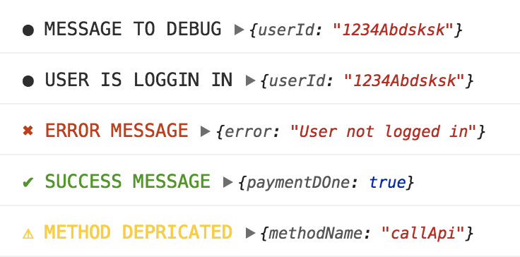

# high-console

🎉🎉🎉🎉 Use same logger for both Browser and Node with zero config out of the box 🎉🎉🎉🎉

Configurable browser and node logger with same API, high-console can be used for logging purposes in a pleasant way and status reporting. It supports colored messages out of the box.

Features:

* Support condintional logging based on the environment.
* Zero Dependency
* Supports colored console statements.
* Comes with common utils like debug, error, warn, success out of the box.
* All styles are configurable. [TODO]



### Quickstart - npm

```shell
npm install high-console
```

### Or using yarn

```shell
yarn add high-console
```

Then require it in your module ...


```javascript
var debug = require('high-console').debug;
```

## OR using ES6 imports


```javascript
import { debug, error, HighConsole } from 'high-console';
```

## API

### debugging

```javascript

import { debug, error, success, warn } from 'high-console';

debug('Message to Debug', {userId: '1234Abdsksk'});
error('Error Message', {userId: '1234Abdsksk'});
success('Success Message', {userId: '1234Abdsksk'});
warn('Warn Message', {userId: '1234Abdsksk'});
```
### Disabled on production

```javascript 

// project entry file

import { HighConsole } from 'high-console';

new HighConsole({ enabled: process.env.NODE_ENV !== 'production' });

```

### Global Config

```javascript

config = { 
  upperCase: true, // uppercase the message to the logger
  enableLabel: true, // Enable the labels (⚠, ✔)
  enabled: true // enable logging to the console
}

new HighConsole(config);
```
